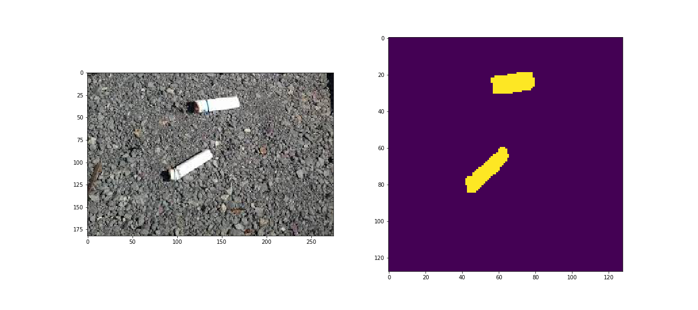
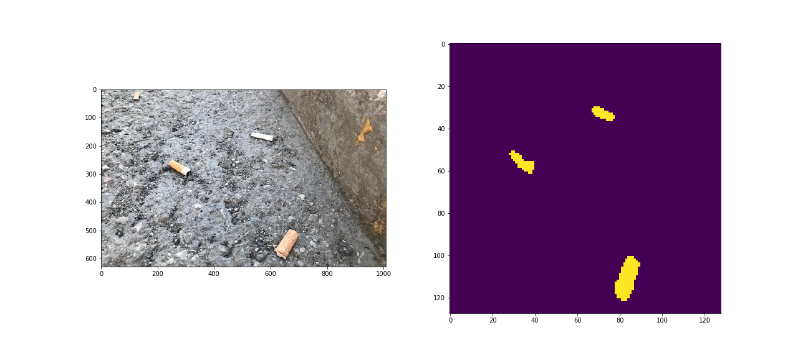

# Cigarette buts detection using U-Net segmentation
Detection of Cigarette buts on the streets using U-net segmentation on Keras.

### Introduction
Cigarette buts on the street has been detected using U-net segmentation using [Keras](https://keras.io/) functional API. Different augmentation methods such as flip, rotate has been used in this repo using albumentations library.

### Installation 

First of all, you need to check if you have all required packages to launch the program. If not then install requirements.

```sh
$ pip3 install -r requirements.txt
```

Then `cd` into `cigarettNet` directory and run `python3 main.py -h` to see usage and options.

```sh
$ cd game
$ python3 main.py -h
```

### Usage
```sh
usage: main.py [-h] [--train] [--predict] [--model_path MODEL_PATH]
               [--img_path IMG_PATH]
optional arguments:
  -h, --help            show this help message and exit
  --train
  --predict
  --model_path MODEL_PATH     give .h5 model file path
  --img_path IMG_PATH   image path
```

* `--predict` - predict the image
    * `--model_path MODEL_PATH` - specify which model (.h5 file) that will be used during prediction time
    * `--img_path IMG_PATH` - specify img_path which will be predicted
    

### Usage example 
**predict an image**
```sh
$ python3 main.py --predict --model_path ../model/out/model.h5
```


### Test Examples





